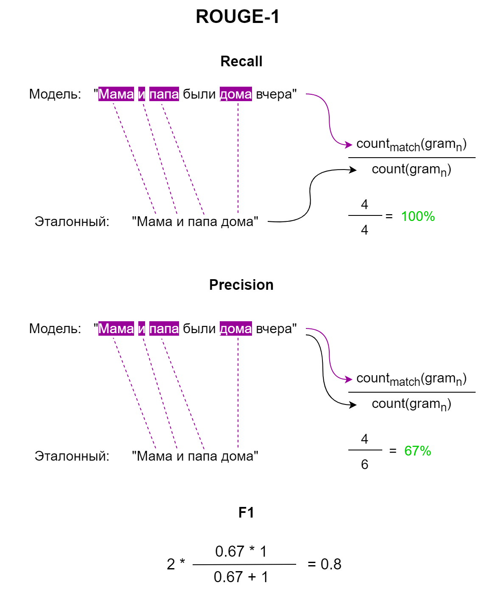
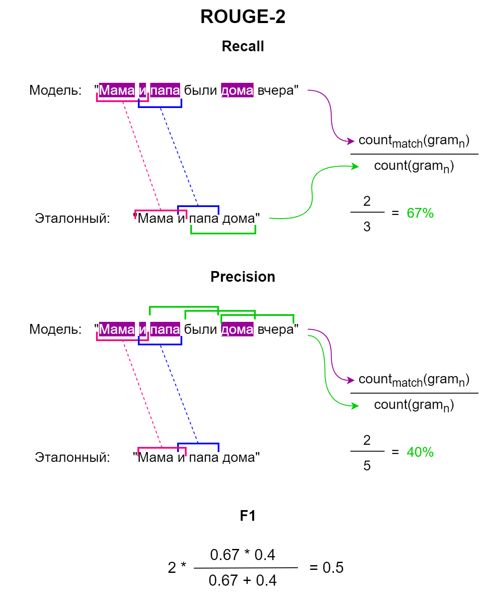
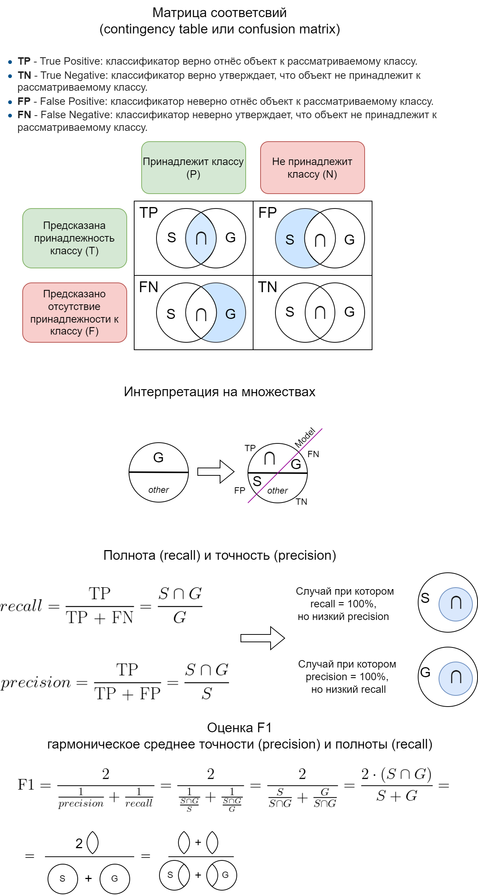
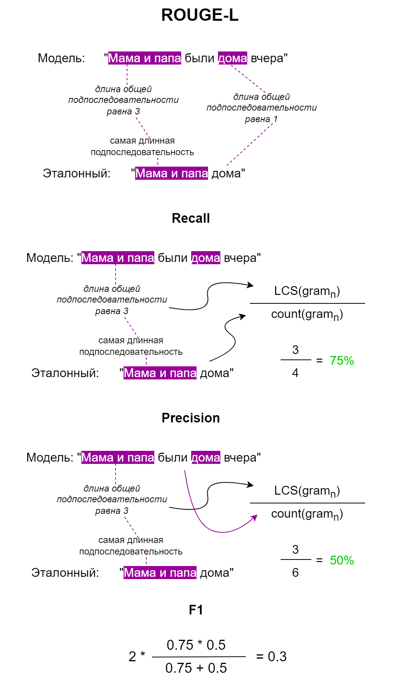

Текст для превью.

<!--more-->


# Сравнение NLP-моделей на задаче суммаризации технических текстов на русском языке


[TOC]


## Постановка задачи

Основной целью данной работы является ответ на вопрос: «==Какая из NLP-моделей== суммаризации (Natural Language Processing – Обработка текстов на естественном языке) наиболее оптимально работает ==в контексте технической литературы на русском языке==»? Под суммаризацией текста понимается процесс ==автоматического сокращения объема исходного текста путем извлечения наиболее важных и существенных идей, фактов и информации==, а также представления в форме краткого и сводного текста, который сохраняет ==основные аспекты исходного материала==.

Анализ текста в эконометрике (econometrics) используется для извлечения данных (text mining) из экономических документов, таких как финансовые отчеты, корпоративные документы, а также новостные ресурсы, для дальнейшего анализ настроений (sentiment analysis), семантического анализа (semantic analysis) и обработки NLP-моделями. На сегодняшний день, направление анализа экономических текстов (analysis of economic texts),  является новым подразделом для курса эконометрики.


- ECONOMETRICS MEETS SENTIMENT: AN OVERVIEW OF METHODOLOGY AND APPLICATIONS (2020) - https://onlinelibrary.wiley.com/doi/epdf/10.1111/joes.12370
- 

## Данные

В качестве данных для проверки использовались тексты (text) научных статей с соответствующими аннотациями (annotation) их авторов на русском языке, ~~изобилующих программным кодом и математическими формулами~~.


Всего … (статистика по данным)


## Модели

Для исследования были выделены наиболее популярные, по версии ресурса Hugging Face, открытые NLP-модели суммаризации текста, обученные на корпусах на русском языке. 

В основе большинства современных NLP-моделей, таких как BERT, GPT, T5 и т.д., используется механизм трансформеров (transformers). Трансформеры – это ==тип нейросетей для обработки последовательностей в последовательности==. Архитектура трансформера состоит из кодировщика и декодировщика, а также слой нормализации (layer normalization) и механизма «внимания» (attention), который позволяет модели «смотреть» на каждое слово в исходном предложении при принятии решения о том, как его трансформировать в контесте.


> Основными компонентами трансформеров являются энкодер и декодер.
>
> (подробнее)

### Источники

- Vaswani, Ashish, et al. "Attention is all you need." *Advances in neural information processing systems* 30 (2017). (URL: https://arxiv.org/pdf/1706.03762.pdf)
- http://nlp.seas.harvard.edu/2018/04/03/attention.html
- https://habr.com/ru/articles/486358/
- https://habr.com/ru/articles/558488/
- https://forklog.com/cryptorium/ai/chto-takoe-transformery-mashinnoe-obuchenie

### GPT-3

Языковая модель GPT-3 (Generative Pre-trained Transformer 3) использует механизмы трансформеров для анализа контекста и генерации последовательностей слов, учитывая вероятность каждого следующего слова на основе предыдущих слов в тексте. Модель также способна выполнить различные задачи, такие как ответы на вопросы, перевод текстов на другие языки и создание текстовых статей.

rugpt3

#### Источники


### T5

Языковая модель T5 (Text-to-Text Transfer Transformer) работает на основе архитектуры Transformer и обучается на задачах преобразования текста в текст. Она принимает на вход задание и исходный текст, а затем генерирует выходной текст, решающий поставленную задачу. Модель обучается на широком спектре задач, включая машинный перевод, генерацию текста, ответы на вопросы, классификацию текста и многое другое.

rut5


### MBart

Модель MBart использует технологию мультиязычного перевода, обученную на большом количестве текстов на разных языках. Каждый язык представлен в виде уникального кода и модель может работать с несколькими языками одновременно. При обучении модели mbart используется подход обучения с подкреплением, который позволяет модели улучшать свой перевод по мере того, как она получает обратную связь. Модель mbart также использует архитектуру Transformer для обработки текста, которая позволяет ей учитывать контекст и зависимости между словами в предложении.

mbart_ru


### Пример

(пример с одной статьей и на разных моделях и подведем к необходимотси оценки)


## Метрики

Для оценки и сравнения языковых моделей можно использовать два подхода:

- Внешняя оценка. Подход, при котором оценивание модели происходит ==за счёт решения с её помощи задачи, на которую она рассчитана, и анализ итоговых показателей== потерь/точности. Это лучший подход к оцениванию моделей, так как это — единственный способ реально оценить то, как разные модели справляются с интересующей нас задачей. Но реализация этого подхода может потребовать больших вычислительных мощностей, его применение может оказаться медленным, так как для этого нужно обучение всей анализируемой системы.
- Внутренняя оценка. Производит поиск некоей метрики для оценки самих языковых моделей, без учёта конкретных задач, для решения которых их планируется использовать. Хотя внутренняя оценка моделей не так «хороша», как внешняя, если речь идёт об итоговой оценке модели, она являет собой полезное средство для быстрого сравнения моделей. Вычисление Perplexity – это метод внутренней оценки моделей.

### Метрика BLEU

#### Общий подход

Метрика BLEU (Bilingual Evaluation Understudy) – это алгоритм оценки качества машинной генерации текста (в том числе перевода), основанный на сравнении выходных текстов, т.е. сгенерированных ~~(references)~~ с известными, эталонными текстами ~~(predictions)~~. Сам подход заключается в ==сравнении двух вариантов текста,  по совпадению слов и их расположению, также это называют схожести n-грамм (последовательности n слов)==. В итоге получается количественная оценка соответствия между результатом работы NLP-модели и результатом работы человека: чем ближе машинная генерация к исходному тексту человека, тем он лучше - такова основная идея BLEU. 

BLEU была одной из первых метрик, которая показывала высокую корреляцию с человеческой (экспертной) оценкой качества соответственно, а также является одной из самых популярных автоматизированных метрик для анализа NLP-моделей и недорогих с точки зрения вычислительных затрат – $O(n^2)$, где n – количество предложений в корпусе, и каждое из них сравнивается с каждым другим, что приводит к квадратичной сложности.

#### Математическое описание

Пусть $C$ – множество слов ==сгенерированного текста== в виде списка слов `[с_1,...]`, $R$ – множество слов ==эталонного текста== `[r_1,...]`, соответственно $c_i$ и $r_i$ – это $ i $-е слова этих множеств (списков). 

Пусть $n$ - максимальная длина n-грамм, которые мы рассматриваем. 

Тогда BLEU оценивает качество сгенерированного текста $C$ путем вычисления взвешенного гармонического среднего точности n-грамм:

$$
\text{BLEU} = \exp \left ( \sum_{n=1}^{N} w_n \log p_n \right ) \cdot \text{BP}
$$
где $p_n$ – это ==точность n-грамм (последовательности n слов) в сгенерированном тексте==, вычисляется как количество n-грамм, которые присутствуют и совпадают с эталонными в сгенерированном тексте, делённое на общее количество n-грамм в сгенерированном тексте:
$$
p_n = \frac{\sum_{i=1}^{N} \sum_{\textbf{n-gram} \in \textbf{c}_{i}} Count(\textbf{n-gram})_{\textbf{r}_{i}}}{\sum_{i=1}^{N} \sum_{\textbf{n-gram} \in \textbf{c}_{i}} Count(\textbf{n-gram})}
$$

$N$ – количество предложений в корпусе, $c_i$ - $i$-я сгенерированная фраза, $\textbf{r}_{i}$ - эталонный перевод для $i$-й кандидатской фразы, $Count(\textbf{n-gram})_{\textbf{r}_{i}}$ – количество вхождений $\textbf{n-gram}$ в $\textbf{r}_{i}$ и $Count(\textbf{n-gram})$ – количество вхождений $\textbf{n-gram}$ в $\textbf{c}_{i}$.

$w_n$ – весовой коэффициент для n-грамм. Обычно используются равные веса для соответствующих n-грамм, например, 1/4 для 4-граммов

$\text{BP}$ – фактор бонуса длины: это компенсирует за то, что короткие переводы могут легко получить высокие оценки BLEU.


BLEU включает корректировки весов, такие как фактор бонуса на основе би-граммов и сглаживание на основе ковариационной матрицы предложений, чтобы справиться с некоторыми из проблем этой методологии. 


- Выпускники школ поступают в университет, чтобы получить новые знания и навыки.
- Выпускники школ поступают в университет для того, чтобы получить новые знания и умения.


```json
{
    'bleu': 0.5873934418709089, 
    'precisions': [0.9230769230769231, 0.75, 0.6363636363636364, 0.5],
    'brevity_penalty': 0.8574039191604413, 
    'length_ratio': 0.8666666666666667, 
    'translation_length': 13, 
    'reference_length': 15
}
```


Для вычисления метрики BLEU берется среднее геометрическое значение измененных показателей точности тестового корпуса и затем умножаем результат на экспоненциальный коэффициент штрафа за краткость.


Баллы рассчитываются для отдельных переведенных сегментов – как правило, предложений – путем сравнения их с набором качественных эталонных переводов. Затем эти баллы усредняются по всему корпусу, чтобы получить оценку общего качества перевода. Ни разборчивость, ни грамматическая правильность не учитываются.

// расширить

#### Программная реализация

Пример реализации метрики BLEU на языке Python:

```python
def bleu_score(candidate, reference):
	pass
```

Однако, как правило, используют готовые реализации данной метрики,  применяя библиотеки: `nltk`, `SacreBLEU`, `TensorFlow`, `PyTorch`, `Fairseq`.

#### Оценка качества

Данная метрика имеет множество известных ограничений:

- BLEU сравнивает совпадение лексем из предсказаний и ссылок, а не сравнивает смысл. Это может привести к расхождениям между оценками BLEU и человеческими оценками.
- Чувствительность к регистрам букв.
- Короткие предсказанные переводы получают более высокие оценки, чем длинные, из-за того, как рассчитывается оценка. Для борьбы с этим вводится штраф за краткость.
- Оценки BLEU не сопоставимы для разных наборов данных и языков.
- Оценки BLEU могут сильно различаться в зависимости от того, какие параметры используются для получения баллов, особенно при использовании различных методов токенизации и нормализации. Поэтому невозможно сравнить оценки BLEU, полученные при использовании разных параметров или когда эти параметры неизвестны. 

#### Источники

* Papineni, Kishore, Salim Roukos, Todd Ward, and Wei-Jing Zhu. "Bleu: a method for automatic evaluation of machine translation." In *Proceedings of the 40th annual meeting of the Association for Computational Linguistics*, pp. 311-318. 2002. (URL: https://aclanthology.org/P02-1040.pdf)
* Оценка метрикой BLEU онлайн: https://huggingface.co/spaces/evaluate-metric/bleu


### Метрика ROUGE

#### Общий подход

ROUGE (Recall-Oriented Understudy for Gisting Evaluation) – это ==набор==  показателей (семейство метрик) для оценки автоматического суммирования текстов (в том числе машинного перевода), основанный на сравнении n-грамм сгенерированного (model) текста с n-граммами эталонных (references) текстов. Основная идея метрики ROUGE заключается в ==сравнении двух текстов и подсчете базовых единиц (n-грамм, т. е. последовательностей слов и количества пар слов)==. В результате получаем количественную оценку работы NLP-модели, которая показывает, насколько сгенерированный текст совпадает с текстом, составленным человеком (экспертом). В отличие от BLEU, ROUGE использует как полноту (recall), так и точность (precision) для сравнения сгенерированных текстов с эталонными текстами, сгенерированными человеком.

В ROUGE-1 сравниваются ==единицы== (слова) между сгенерированным и эталонным текстами. В ROUGE-2 сравниваются ==последовательности из двух слов==, взятых из сгенерированного и эталонного текста. В ряде источников ROUGE-1 и ROUGE-2 могут обозначаться общей записью ROUGE-N. ROUGE-L, в свою очередь, ==не сравнивает n-граммы, а обрабатывает тексты и ищет самую длинную последовательность (LCS), которая является общей для двух текстов==, а затем измеряет ее длину.

#### Математическое описание

Пусть $S$ – сгенерированный текст, $G$ – эталонный текст, а $s_i$ и $g_i$ - соответственно $i$-е слова в $S$ и $G$.

ROUGE-1 оценивает качество генерации из $S$ путем вычисления точности совпадения слов в $S$ с $G$. Подсчитывает количество совпадающих (co-occurrences) n-грамм (для ROUGE-1 это одно слово или их еще называют Unigrams), найденных как в выходных данных модели, так и в эталоне, а затем делит это число на общее количество n-грамм в $S$:

$$
\text{ROUGE-1} = \frac{\sum_{i} Count_{match}(s_i)}{\sum_{i} Count(s_i)}
$$
где $Count_{match}(s_i)$ – число вхождений слова $s_i$ в обоих текстах $S$ и $G$, а $Count(s_i)$ – общее число n-грамм $s_i$ в $S$.



ROUGE-2 оперирует уже парами слов (биграмма – Bigrams):

$$
\text{ROUGE-2} = \frac{\sum_{i} Count_{match}(s_i-1, s_i)}{\sum_{i} Count(s_i-1, s_i)}
$$



ROUGE-N, где $N > 2$, аналогичен ROUGE-2, но использует $N$-граммы.

> Имея значения:
>
> - полнота (пригодность, соответствие) (recall или fitness) – отношение количества верно сгенерированных предложений к количеству эталонных предложений, $recall = \frac{S \cap G}{G}$ показывает, ==насколько полно модель выявляет нужные предложения==;
> - точность (precision) – отношение количества верно сгенерированных предложений к количеству сгенерированных предложений, $precision = \frac{S \cap G}{S}$ показывает, ==насколько точно модель выявляет нужные предложения==.
>
> Можно рассчитать оценку ROUGE-F1, которая также является метрикой F1-score для оценки точности классификационных моделей и вычисляется  как гармоническое среднее точности (precision) и полноты (recall):
>
> $$
> \text{ROUGE-F1} = \frac{2}{\frac{1}{precision} + \frac{1}{recall}} = 2 \cdot \frac{precision \cdot recall}{precision + recall}
> $$
>
> 
>
> precision и recall вычисляются отдельно, а F1-score используется в качестве основной метрики. ==Чем больше значение F1-score, тем ближе автоматически сгенерированный текст к оригинальному==.

ROUGE-L сравнивает последовательности слов, которые являются общими для обоих текстов:

$$
\text{ROUGE-L} = \frac{\text{LCS}(S, G)}{max(|S|, |G|)}
$$

где $\text{LCS}(S, G)$ – самая длинная общая последовательность слов в $S$ и $G$, а $max(|S|, |G|)$ – максимальное значение между количеством слов в $S$ и $G$. 




ROUGE-S измеряет длину общей последовательности согласованных слов с использованием плавающего окна. Плавающее окно - это диапазон слов в сводке, который сопоставляется с диапазоном слов в эталонной сводке.




#### Программная реализация

```python
from rouge import Rouge

# Создаем объект метрики ROUGE
rouge = Rouge()

# Получить ROUGE-1 метрику между двумя текстами
model_out  = "Мама и папа были дома вчера"
reference = "Мама и папа дома"

scores = rouge.get_scores(model_out, reference)

# Выводим результаты
print(scores)
```

```json
[
	{
        'rouge-1': {
            'r': 1.0, 
            'p': 0.6666666666666666, 
            'f': 0.7999999952000001
        },
        'rouge-2': {
            'r': 0.6666666666666666, 
            'p': 0.4, 
            'f': 0.49999999531250006
        },
        'rouge-l': {
            'r': 1.0, 
            'p': 0.6666666666666666, 
            'f': 0.7999999952000001
        }
    }
]
```

В выводе под `"f"` обозначается F1-score, `"p"` – precision, `"r"` – recall, и, в результате, при анализе необходимо ориентироваться на значения `"f"`, как  на более сбалансированную характеристику.

Асимптотическая сложность – $O(n^2)$, где $n$ – это количество n-грамм в сгенерированном и эталонном текстах. Это связано с необходимостью вычисления всех возможных комбинаций согласованных n-грамм между двумя текстами.

#### Оценка качества

Достоинства:
- ROUGE хорошо коррелирует с экспертной оценкой качества сгенерированных текстов.
- Учитывает как полноту, так и точность выходных текстов.
- Используется для оценки качества не только для задачи суммаризации, но и других типов генерации текстов.

Недостатки:
- ROUGE не учитывает семантическое соответствие между сгенерированным и исходным текстом, что приводит к тому, что он может давать высокую оценку для низкокачественных сгенерированных текстов, которые содержат много извлеченных фрагментов.
- Некоторые варианты ROUGE могут работать только на определенном языке или быть ограничены по размеру текста.
- Поскольку ROUGE оценивает только качество относительно исходного текста, он может не показывать, насколько хорошо сгенерированный текст работает сам по себе.

#### Источники

- Lin, Chin-Yew. "Rouge: A package for automatic evaluation of summaries." In *Text summarization branches out*, pp. 74-81. 2004. (URL: https://aclanthology.org/W04-1013.pdf)
- Оценка метрикой ROUGE онлайн: https://huggingface.co/spaces/evaluate-metric/rouge
- https://towardsdatascience.com/the-ultimate-performance-metric-in-nlp-111df6c64460
- https://www.mlr2d.org/modules/process-mining/00b_evaluation


### Метрика Perplexity

#### Общий подход

Perplexity (PPL) – 

Метрика Перплексия в языковых моделях используется для оценки того, насколько хорошо модель может предсказать следующее слово в тексте. Чем ниже значение перплексии, тем лучше модель. 

Для сравнения двух текстов с помощью метрики Перплексия необходимо сначала обучить языковую модель на одном из текстов, а затем посчитать перплексию на другом тексте. Если перплексия на другом тексте будет низкой, то это будет означать, что модель хорошо предсказывает слова в этом тексте и соответственно, тексты похожи. Если перплексия будет высокой, то это будет означать, что модель плохо предсказывает слова в этом тексте и тексты различаются. 

Например, если сравнить два текста: "Коты любят молоко" и "Собаки любят кости". Мы можем обучить языковую модель на первом тексте и вычислить перплексию на втором тексте. Если перплексия будет низкой, то это будет означать, что модель хорошо предсказывает слова во втором тексте и тексты похожи. Если перплексия будет высокой, то это будет означать, что модель плохо предсказывает слова во втором тексте и тексты различаются.


Для хорошей NLP-модели, метрика Perplexity, будет давать высокие вероятности синтаксически корректным предложениям, а предложениям  некорректным, или очень редко встречающимся – низкие вероятности. При условии, что набор данных состоит из корректных предложений, лучшей моделью будет та, которая назначит наивысшую вероятность этому тестовому набору, что означает, что модель обладает хорошим пониманием того, как устроен язык. 


#### Математическое описание
$$
P(W) = 2^{-\frac{1}{N}\sum_{i=1}^{N}log_2P(w_i|w_{i-1},...,w_{i-n+1})}
$$


$$
PP(W) = \sqrt[N]{\frac{1}{P(w_1, w_2, ..., w_N)}}
$$


#### Программная реализация

#### Оценка качества

#### Источники

- Оценка Perplexity онлайн: https://huggingface.co/spaces/evaluate-metric/perplexity
- https://habr.com/ru/companies/wunderfund/articles/580230/
- https://towardsdatascience.com/perplexity-in-language-models-87a196019a94
- https://thegradient.pub/understanding-evaluation-metrics-for-language-models/


## Результаты

… (описание таблицы с результатами)

| Модель                                                       | BLEU     | ROUGE-1  | ROUGE-2  | ROUGE-L  | Perplexity |
| ------------------------------------------------------------ | -------- | -------- | -------- | -------- | ---------- |
| [mbart_ru_sum_gazeta](https://huggingface.co/IlyaGusev/mbart_ru_sum_gazeta) | 12.1     | **32.4** | 14.3     | 28.0     |            |
| [rut5_base_sum_gazeta](https://huggingface.co/IlyaGusev/rut5_base_sum_gazeta) | **12.3** | 32.2     | **14.4** | **28.1** |            |
| [rugpt3medium_sum_gazeta](https://huggingface.co/IlyaGusev/rugpt3medium_sum_gazeta) | 4.3      | 26.2     | 7.7      | 21.7     |            |

… (интерпретация графика)


… (выводы и дальнейшее исследование)


## Источники (для публикации)

[1] 
